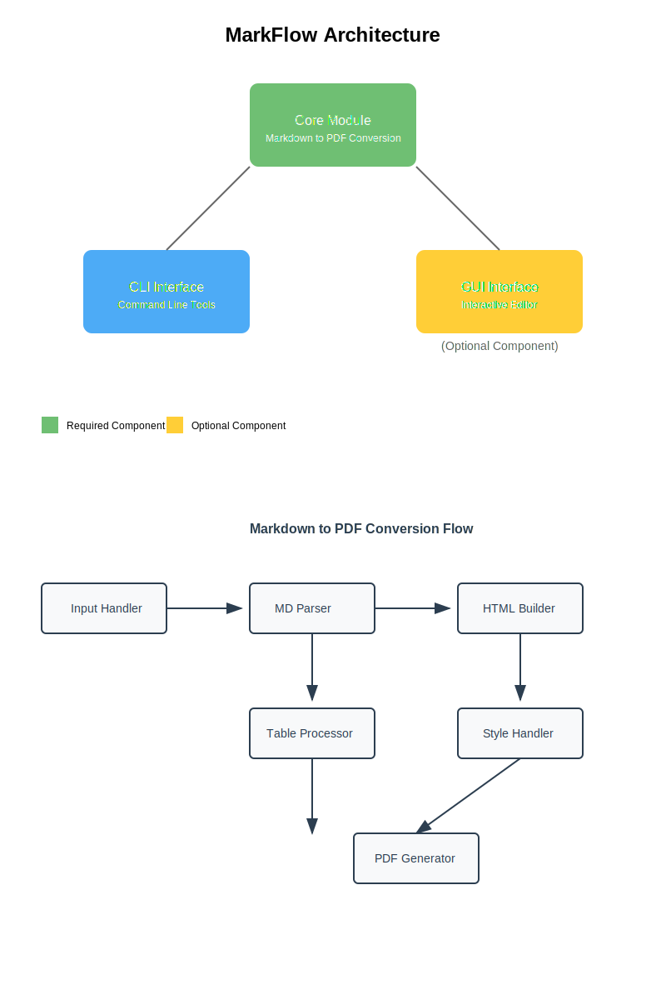

# MarkFlow: Modern Markdown to PDF Converter

<div align="center">


[](https://www.python.org/downloads/)
[](LICENSE)
[](https://github.com/psf/black)

*Convert Markdown files to beautifully formatted PDFs with ease*

[Installation](#installation) • [Usage](#usage) • [Features](#features) • [Contributing](#contributing) • [Documentation](#documentation)

</div>

## ✨ Features

- 📝 **Dual Interface**: Choose between CLI or GUI based on your needs
- 🎨 **Real-time Preview**: Instant visualization of your markdown (GUI mode)
- 🚀 **Fast Conversion**: Efficient markdown to PDF processing
- 🎯 **Modular Design**: Use only what you need
- 🎭 **Syntax Highlighting**: Beautiful code formatting
- 📊 **Table Support**: Clean table rendering
- 🔧 **Customizable**: Style with custom CSS

## 🚀 Installation

### Basic Installation (CLI Only)
```bash
pip install markflow
```

### Full Installation (with GUI)
```bash
pip install markflow[gui]
```

## 💡 Usage

### CLI Mode
```bash
# Basic conversion
markflow input.md output.pdf

# With custom styling
markflow input.md output.pdf --style custom.css
```

### GUI Mode
```bash
# Launch the interactive editor
markflow-gui
```

### Python API
```python
from markflow.core import convert_to_pdf

# Convert a file
convert_to_pdf('input.md', 'output.pdf')
```

## 🏗️ Architecture



MarkFlow uses a modular architecture:
- **Core Module**: Handles markdown parsing and PDF generation
- **CLI Interface**: Command-line tools for quick conversions
- **GUI Module** (Optional): Interactive editor with real-time preview

## 🛠️ Development

### Setup Development Environment
```bash
# Clone the repository
git clone https://github.com/yourusername/markflow.git
cd markflow

# Create virtual environment
python -m venv venv
source venv/bin/activate  # Linux/Mac
venv\\Scripts\\activate   # Windows

# Install dependencies
pip install -r requirements-dev.txt
```

### Running Tests
```bash
# Run all tests
./tests/run_tests.sh

# Run specific test
python -m unittest tests/test_core.py
```

## 📚 Documentation

- [User Guide](docs/user_guide.md)
- [API Reference](docs/api_reference.md)
- [Development Notes](docs/development.md)
- [Contributing Guidelines](CONTRIBUTING.md)

## 🤝 Contributing

We welcome contributions! See our [Contributing Guidelines](CONTRIBUTING.md) for details.

1. Fork the repository
2. Create your feature branch (`git checkout -b feature/amazing-feature`)
3. Commit your changes (`git commit -m 'Add amazing feature'`)
4. Push to the branch (`git push origin feature/amazing-feature`)
5. Open a Pull Request

## 📄 License

This project is licensed under the MIT License - see the [LICENSE](LICENSE) file for details.

## 🙏 Acknowledgments

- [WeasyPrint](https://weasyprint.org/) for PDF generation
- [PyQt6](https://www.riverbankcomputing.com/software/pyqt/) for the GUI interface
- [Python-Markdown](https://python-markdown.github.io/) for markdown processing

---

<div align="center">
Made with ❤️ by the MarkFlow team
</div>
