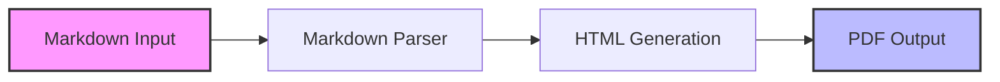
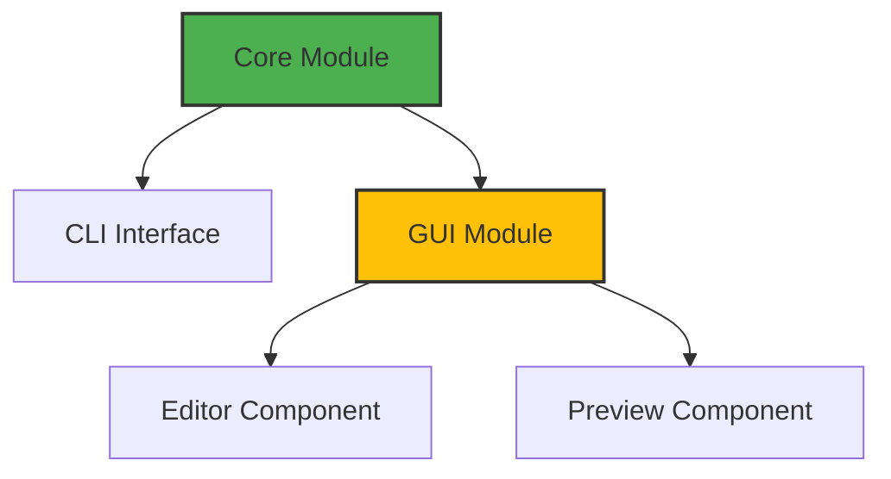

# MarkFlow Development Guide

## Overview

MarkFlow is designed with modularity in mind, separating core functionality from user interfaces. This guide will help you understand the codebase and contribute effectively.

## Architecture

### Core Module (`md_to_pdf/core.py`)
- Handles markdown parsing
- Manages PDF generation
- Provides the main conversion API

### CLI Interface (`md_to_pdf/cli.py`)
- Command-line interface
- Argument parsing
- Progress reporting

### GUI Module (`md_to_pdf/gui/`)
- Interactive editor (`editor.py`)
- Real-time preview (`preview.py`)
- Main window management (`main_window.py`)

## Component Diagrams

### Data Flow


### Module Interaction


## Development Setup

1. **Environment Setup**
   ```bash
   python -m venv venv
   source venv/bin/activate
   pip install -r requirements-dev.txt
   ```

2. **Running Tests**
   ```bash
   # All tests
   ./tests/run_tests.sh
   
   # Specific components
   python -m unittest tests/test_core.py
   python -m unittest tests/test_gui.py
   ```

3. **Code Style**
   ```bash
   # Format code
   black .
   
   # Check style
   flake8
   ```

## Best Practices

### Code Organization
- Keep modules focused and single-responsibility
- Use clear, descriptive names
- Document public APIs
- Add type hints

### Testing
- Write unit tests for new features
- Update tests when modifying code
- Test edge cases
- Manual testing for GUI features

### Git Workflow
1. Create feature branch
2. Make focused commits
3. Write clear commit messages
4. Update documentation
5. Submit pull request

## Common Tasks

### Adding a New Feature
1. Identify target module
2. Create tests first
3. Implement feature
4. Update documentation
5. Submit pull request

### Fixing Bugs
1. Create reproduction test
2. Fix the bug
3. Verify fix with test
4. Update documentation
5. Submit pull request

## GUI Development

### Component Structure
```
gui/
├── __init__.py
├── editor.py      # Markdown editor
├── preview.py     # PDF preview
└── main_window.py # Main application window
```

### Key Classes
- `MarkdownEditor`: Text editing component
- `PreviewPanel`: Real-time preview
- `MainWindow`: Application window

### Event Flow
1. User edits markdown
2. Editor emits change signal
3. Preview updates with delay
4. PDF generation triggered

## Performance Considerations

1. **Memory Management**
   - Clear temporary files
   - Manage large documents efficiently
   - Use streaming where possible

2. **GUI Responsiveness**
   - Debounce preview updates
   - Use background processing
   - Avoid blocking operations

3. **PDF Generation**
   - Optimize image handling
   - Cache intermediate results
   - Use incremental updates

## Release Process

1. **Preparation**
   - Update version number
   - Update changelog
   - Run full test suite
   - Update documentation

2. **Testing**
   - Test on all supported platforms
   - Verify all features
   - Check documentation

3. **Release**
   - Tag version
   - Build distribution
   - Upload to PyPI
   - Update documentation

## Support

- GitHub Issues for bug reports
- Pull Requests for contributions
- Documentation updates welcome

## Future Development

1. **Planned Features**
   - Enhanced table support
   - Custom themes
   - Export templates
   - Plugin system

2. **Improvements**
   - Performance optimization
   - Better error handling
   - More customization options
   - Extended markdown support
